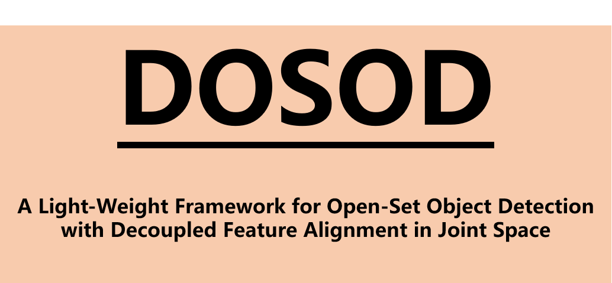
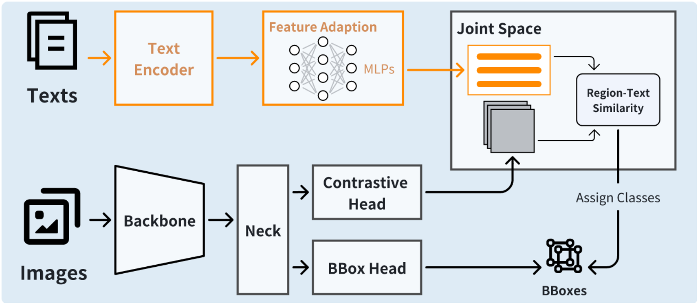

<div align="center">
<br>

<br>
<a href="https://github.com/YonghaoHe">Yonghao He</a><sup><span>1,*,🌟 </span></sup>, 
<a href="https://people.ucas.edu.cn/~suhu">Hu Su</a><sup><span>2,*,📧</span></sup>,
<a href="https://github.com/HarveyYesan">Haiyong Yu</a><sup><span>1,*</span></sup>,
<a href="https://cong-yang.github.io/">Cong Yang</a><sup><span>3</span></sup>,
<a href="">Wei Sui</a><sup><span>1</span></sup>,
<a href="">Cong Wang</a><sup><span>1</span></sup>,
<a href="www.amnrlab.org">Song Liu</a><sup><span>4,📧</span></sup>
<br>

\* Equal contribution, 🌟 Project lead, 📧 Corresponding author

<sup>1</sup> D-Robotics, <br>
<sup>2</sup> State Key Laboratory of Multimodal Artificial Intelligence Systems(MAIS), Institute of Automation of Chinese Academy of Sciences,<br>
<sup>3</sup> BeeLab, School of Future Science and Engineering, Soochow University, <br>
<sup>4</sup> the School of Information Science and Technology, ShanghaiTech
University
<br>
<div>

[](https://arxiv.org/abs/2412.14680)
[](LICENSE)

</div>
</div>

## 🔥 Updates

`[2024-12-27]`: Decoupled Open-Set Object Detector (DOSOD) with ultra real-time speed and superior accuracy is released.

## 1. Introduction

### 1.1 Brief Introduction of DOSOD

<div align="center">

</div>

Thanks to the new SOTA in open-vocabulary object detection established by YOLO-World,
open-vocabulary detection has been extensively applied in various scenarios.
Real-time open-vocabulary detection has attracted significant attention.
In our paper, Decoupled Open-Set Object Detection (**DOSOD**) is proposed as a
practical and highly efficient solution for supporting real-time OSOD tasks in robotic systems.
Specifically, DOSOD is constructed based on the YOLO-World pipeline by integrating a vision-language model (VLM) with a detector.
A Multilayer Perceptron (MLP) adaptor is developed to convert text embeddings extracted by the VLM into a joint space,
within which the detector learns the region representations of class-agnostic proposals.
Cross-modality features are directly aligned in the joint space,
avoiding the complex feature interactions and thereby improving computational efficiency.
DOSOD functions like a traditional closed-set detector during the testing phase,
effectively bridging the gap between closed-set and open-set detection.

### 1.2 Repo Structure
Our implementation is based on [YOLO-World](https://github.com/AILab-CVC/YOLO-World), the newly added code can be found in the following scripts:
* [yolo_world/models/detectors/dosod.py](yolo_world/models/detectors/dosod.py) [yolo_world/models/dense_heads/dosod_head.py](yolo_world/models/dense_heads/dosod_head.py) <br> The two scripts contain the core code segments of DOSOD.
* [configs/dosod](configs/dosod) <br> This folder contains all DOSOD configs for training, evaluation and inference.
* [tools/generate_text_prompts_dosod.py](tools/generate_text_prompts_dosod.py) <br> Generating texts embeddings for DOSOD
* [tools/reparameterize_dosod.py](tools/reparameterize_dosod.py) <br> Reparameterizing original weights with generated texts embeddings
* [tools/count_num_parameters.py](tools/count_num_parameters.py) <br> Simple code for calculating the amount of parameters
* [tools/evaluate_latency.sh](tools/evaluate_latency.sh) <br> The shell for latency evaluation on NVIDIA GPU

## 2. Model Overview

Following YOLO-World, we also pre-trained DOSOD-S/M/L from scratch on public datasets and conducted zero-shot evaluation on the `LVIS minival` and `COCO val2017`.
All pre-trained models are released.

### 2.1 Zero-shot Evaluation on LVIS minival

<div><font size=2>

|                                                                                     model                                                                                      | Pre-train Data | Size | AP<sup>mini</sup> | AP<sub>r</sub> | AP<sub>c</sub> | AP<sub>f</sub> |                                                              weights                                                               |
|:------------------------------------------------------------------------------------------------------------------------------------------------------------------------------:|:---------------|:-----|:-----------------:|:--------------:|:--------------:|:--------------:|:----------------------------------------------------------------------------------------------------------------------------------:|
| <div style="text-align: center;">[YOLO-Worldv1-S](./configs/pretrain_v1/yolo_world_s_dual_vlpan_l2norm_2e-3_100e_4x8gpus_obj365v1_goldg_train_lvis_minival.py)<br>(repo)</div> | O365+GoldG     | 640  |       24.3        |      16.6      |      22.1      |      27.7      | [HF Checkpoints 🤗](https://huggingface.co/wondervictor/YOLO-World/blob/main/yolo_world_v2_s_obj365v1_goldg_pretrain-55b943ea.pth) |
| <div style="text-align: center;">[YOLO-Worldv1-M](./configs/pretrain_v1/yolo_world_m_dual_vlpan_l2norm_2e-3_100e_4x8gpus_obj365v1_goldg_train_lvis_minival.py)<br>(repo)</div> | O365+GoldG     | 640  |       28.6        |      19.7      |      26.6      |      31.9      | [HF Checkpoints 🤗](https://huggingface.co/wondervictor/YOLO-World/blob/main/yolo_world_v2_m_obj365v1_goldg_pretrain-c6237d5b.pth) | 
| <div style="text-align: center;">[YOLO-Worldv1-L](./configs/pretrain_v1/yolo_world_l_dual_vlpan_l2norm_2e-3_100e_4x8gpus_obj365v1_goldg_train_lvis_minival.py)<br>(repo)</div> | O365+GoldG     | 640  |       32.5        |      22.3      |      30.6      |      36.1      | [HF Checkpoints 🤗](https://huggingface.co/wondervictor/YOLO-World/blob/main/yolo_world_v2_l_obj365v1_goldg_pretrain-a82b1fe3.pth) | 
|                                                      <div style="text-align: center;">[YOLO-Worldv1-S]()<br>(paper)</div>                                                      | O365+GoldG     | 640  |       26.2        |      19.1      |      23.6      |      29.8      | [HF Checkpoints 🤗](https://huggingface.co/wondervictor/YOLO-World/blob/main/yolo_world_v2_s_obj365v1_goldg_pretrain-55b943ea.pth) |
|                                                      <div style="text-align: center;">[YOLO-Worldv1-M]()<br>(paper)</div>                                                      | O365+GoldG     | 640  |       31.0        |      23.8      |      29.2      |      33.9      | [HF Checkpoints 🤗](https://huggingface.co/wondervictor/YOLO-World/blob/main/yolo_world_v2_m_obj365v1_goldg_pretrain-c6237d5b.pth) | 
|                                                      <div style="text-align: center;">[YOLO-Worldv1-L]()<br>(paper)</div>                                                      | O365+GoldG     | 640  |       35.0        |      27.1      |      32.8      |      38.3      | [HF Checkpoints 🤗](https://huggingface.co/wondervictor/YOLO-World/blob/main/yolo_world_v2_l_obj365v1_goldg_pretrain-a82b1fe3.pth) |
|                              [YOLO-Worldv2-S](./configs/pretrain/yolo_world_v2_s_vlpan_bn_2e-3_100e_4x8gpus_obj365v1_goldg_train_lvis_minival.py)                              | O365+GoldG     | 640  |       22.7        |      16.3      |      20.8      |      25.5      | [HF Checkpoints 🤗](https://huggingface.co/wondervictor/YOLO-World/blob/main/yolo_world_v2_s_obj365v1_goldg_pretrain-55b943ea.pth) |
|                              [YOLO-Worldv2-M](./configs/pretrain/yolo_world_v2_m_vlpan_bn_2e-3_100e_4x8gpus_obj365v1_goldg_train_lvis_minival.py)                              | O365+GoldG     | 640  |       30.0        |      25.0      |      27.2      |      33.4      | [HF Checkpoints 🤗](https://huggingface.co/wondervictor/YOLO-World/blob/main/yolo_world_v2_m_obj365v1_goldg_pretrain-c6237d5b.pth) | 
|                              [YOLO-Worldv2-L](./configs/pretrain/yolo_world_v2_l_vlpan_bn_2e-3_100e_4x8gpus_obj365v1_goldg_train_lvis_minival.py)                              | O365+GoldG     | 640  |       33.0        |      22.6      |      32.0      |      35.8      | [HF Checkpoints 🤗](https://huggingface.co/wondervictor/YOLO-World/blob/main/yolo_world_v2_l_obj365v1_goldg_pretrain-a82b1fe3.pth) | 
|                                     [DOSOD-S](./configs/joint_space/joint_space_mlp3x_s_100e_1x8gpus_obj365v1_goldg_train_lvis_minival.py)                                     | O365+GoldG     | 640  |       26.7        |      19.9      |      25.1      |      29.3      |                      [HF Checkpoints 🤗](https://huggingface.co/D-Robotics/DOSOD/blob/main/dosod_mlp3x_s.pth)                      |
|                                     [DOSOD-M](./configs/joint_space/joint_space_mlp3x_m_100e_1x8gpus_obj365v1_goldg_train_lvis_minival.py)                                     | O365+GoldG     | 640  |       31.3        |      25.7      |      29.6      |      33.7      |                              [HF Checkpoints 🤗](https://huggingface.co/D-Robotics/DOSOD/blob/main/dosod_mlp3x_m.pth)                                                                                                       | 
|                                     [DOSOD-L](./configs/joint_space/joint_space_mlp3x_l_100e_1x8gpus_obj365v1_goldg_train_lvis_minival.py)                                     | O365+GoldG     | 640  |       34.4        |      29.1      |      32.6      |      36.6      |                                       [HF Checkpoints 🤗](https://huggingface.co/D-Robotics/DOSOD/blob/main/dosod_mlp3x_l.pth)                                                                                              | 

> NOTE: The results of YOLO-Worldv1 from [repo](./configs/pretrain_v1) and [paper](https://arxiv.org/abs/2401.17270) are different.

</font>
</div>

### 2.2 Zero-shot Inference on COCO dataset

<div><font size=2>

|                                                        model                                                         | Pre-train Data | Size |  AP  | AP<sub>50</sub> | AP<sub>75</sub> | 
|:--------------------------------------------------------------------------------------------------------------------:|:---------------|:-----|:----:|:---------------:|:---------------:|
|                         <div style="text-align: center;">[YOLO-Worldv1-S]()<br>(paper)</div>                         | O365+GoldG     | 640  | 37.6 |      52.3       |      40.7       |
|                         <div style="text-align: center;">[YOLO-Worldv1-M]()<br>(paper)</div>                         | O365+GoldG     | 640  | 42.8 |      58.3       |      46.4       |
|                         <div style="text-align: center;">[YOLO-Worldv1-L]()<br>(paper)</div>                         | O365+GoldG     | 640  | 44.4 |      59.8       |      48.3       |
| [YOLO-Worldv2-S](./configs/pretrain/yolo_world_v2_s_vlpan_bn_2e-3_100e_4x8gpus_obj365v1_goldg_train_lvis_minival.py) | O365+GoldG     | 640  | 37.5 |      52.0       |      40.7       |
| [YOLO-Worldv2-M](./configs/pretrain/yolo_world_v2_m_vlpan_bn_2e-3_100e_4x8gpus_obj365v1_goldg_train_lvis_minival.py) | O365+GoldG     | 640  | 42.8 |      58.2       |      46.7       | 
| [YOLO-Worldv2-L](./configs/pretrain/yolo_world_v2_l_vlpan_bn_2e-3_100e_4x8gpus_obj365v1_goldg_train_lvis_minival.py) | O365+GoldG     | 640  | 45.4 |      61.0       |      49.4       | 
|        [DOSOD-S](./configs/joint_space/joint_space_mlp3x_s_100e_1x8gpus_obj365v1_goldg_train_lvis_minival.py)        | O365+GoldG     | 640  | 36.1 |      51.0       |      39.1       |
|        [DOSOD-M](./configs/joint_space/joint_space_mlp3x_m_100e_1x8gpus_obj365v1_goldg_train_lvis_minival.py)        | O365+GoldG     | 640  | 41.7 |      57.1       |      45.2       | 
|        [DOSOD-L](./configs/joint_space/joint_space_mlp3x_l_100e_1x8gpus_obj365v1_goldg_train_lvis_minival.py)        | O365+GoldG     | 640  | 44.6 |      60.5       |      48.4       | 

</font>
</div>

### 2.3 Latency On RTX 4090

We utilize the tool of `trtexec` in [TensorRT 8.6.1.6](https://developer.nvidia.com/tensorrt) to assess the latency in FP16 mode.
All models are re-parameterized with 80 categories from COCO.
Log info can be found by click the FPS.

|     model      | Params |                   FPS                   |
|:--------------:|:------:|:---------------------------------------:|
| YOLO-Worldv1-S | 13.32M | [1007](./assets/yolo-worldv1-s-4090.md) |
| YOLO-Worldv1-M | 28.93M | [702](./assets/yolo-worldv1-m-4090.md)  |
| YOLO-Worldv1-L | 47.38M | [494](./assets/yolo-worldv1-l-4090.md)  |
| YOLO-Worldv2-S | 12.66M | [1221](./assets/yolo-worldv2-s-4090.md) |
| YOLO-Worldv2-M | 28.20M | [771](./assets/yolo-worldv2-m-4090.md)  |
| YOLO-Worldv2-L | 46.62M | [553](./assets/yolo-worldv2-l-4090.md)  |
|    DOSOD-S     | 11.48M |    [1582](./assets/dosod-s-4090.md)     |
|    DOSOD-M     | 26.31M |     [922](./assets/dosod-m-4090.md)     |
|    DOSOD-L     | 44.19M |     [632](./assets/dosod-l-4090.md)     |

> NOTE: FPS = 1000 / GPU Compute Time[mean]

### 2.4 Latency On RDK X5

We evaluate the real-time performance of the YOLO-World-v2 model and our DOSOD model on the development kit of [D-Robotics RDK X5](https://d-robotics.cc/rdkx5).
The models are re-parameterized with 1203 categories defined in LVIS. We run the models on the RDK X5 using either 1 thread or 8 threads with INT8 or INT16 quantization modes.

|              model              | FPS (1 thread) | FPS (8 threads) |
|:-------------------------------:|:--------------:|:---------------:|
| YOLO-Worldv2-S<br/>(INT16/INT8) |  5.962/11.044  |  6.386/12.590   |
| YOLO-Worldv2-M<br/>(INT16/INT8) |  4.136/7.290   |   4.340/7.930   |
| YOLO-Worldv2-L<br/>(INT16/INT8) |  2.958/5.377   |   3.060/5.720   |
|    DOSOD-S<br/>(INT16/INT8)     | 12.527/31.020  |  14.657/47.328  |
|    DOSOD-M<br/>(INT16/INT8)     |  8.531/20.238  |   9.471/26.36   |
|    DOSOD-L<br/>(INT16/INT8)     |  5.663/12.799  |  6.069/14.939   |

## 3. Getting Started
Most of the steps are consistent with those in [YOLO-World README.md file](./README-YW.md#getting-started). 
Some extra things need attention are as follows:  

* clone project: ```git clone https://github.com/D-Robotics-AI-Lab/DOSOD.git```
* latency evaluation: we provide [script](tools/evaluate_latency.sh) to evaluate the latency on NVIDIA GPU
* note: We pre-train DOSOD on 8 NVIDIA RTX 4090 GPUs with a batchsize of 128 while YOLO-World uses 32 NVIDIA V100 GPUs with the batchsize of 512.


## 4. Reparameterization and Inference
### 4.1 On NVIDIA RTX 4090
* Step 1: generate texts embeddings
```
python tools/generate_text_prompts_dosod.py path_to_config_file path_to_model_file --text path_to_texts_json_file --out-dir dir_to_save_embedding_npy_file
```
> `path_to_config_file` is the config for training <br>
> `path_to_model_file` the pth model file corresponding to `path_to_config_file` <br>
> `path_to_texts_json_file` contains the vocabulary, for example `data/texts/coco_class_texts.json`

* Step 2: reparameterize model weights
```
python tools/reparameterize_dosod.py --model path_to_model_file --out-dir dir_to_save_rep_model_file --text-embed path_to_embedding_npy_file
```
> `path_to_embedding_npy_file` is the output from step 1

* Step 3: export onnx using rep-style config
```
python deploy/export_onnx.py path_to_rep_config_file path_to_rep_model_file --without-nms --work-dir dir_to_save_rep_onnx_file
```
> `path_to_rep_config_file` is the modified config for rep, for example `configs/dosod/rep_dosod_mlp3x_s_100e_1x8gpus_obj365v1_goldg_train_lvis_minival.py`
> `path_to_rep_model_file` is the output from step 2

* Step 4: run onnx demo
```
python deploy/onnx_demo.py path_to_rep_onnx_file path_to_test_image path_to_texts_json_file --output-dir dir_to_save_result_image --onnx-nms
```
> `path_to_rep_onnx_file` is the output from step 3

### 4.2 On RDK X5
To make the model available for RDK X5, we need to use another config file in Step 3: <br>
`path_to_rep_config_file` should be files with suffix *_d-robotics.py*, for exmaple `configs/dosod/rep_dosod_mlp3x_s_d-robotics.py`
For more details, you can refer to [code file](yolo_world/models/dense_heads/dosod_head.py).
> To run onnx model on RDK X5, you can refer to the [website](https://developer.d-robotics.cc/rdkx5) for more help.

## Acknowledgement

We sincerely thank [YOLO-World](https://github.com/AILab-CVC/YOLO-World), [mmyolo](https://github.com/open-mmlab/mmyolo), [mmdetection](https://github.com/open-mmlab/mmdetection), [GLIP](https://github.com/microsoft/GLIP), and [transformers](https://github.com/huggingface/transformers) for providing their wonderful code to the community!

## Citations

If you find DOSOD is useful in your research or applications, please consider giving us a star 🌟 and citing it.

```bibtex
@inproceedings{He2024DOSOD,
  title={A Light-Weight Framework for Open-Set Object Detection with Decoupled Feature Alignment in Joint Space},
  author={He, Yonghao and Su, Hu and Yu, Haiyong and Yang, Cong and Sui, Wei and Wang, Cong and Liu, Song},
  booktitle={arXiv:2412.14680},
  year={2024}
}
```

## Licence
DOSOD is under the GPL-v3 Licence and is supported for commercial usage. If you need a commercial license for DOSOD, please feel free to contact us.
